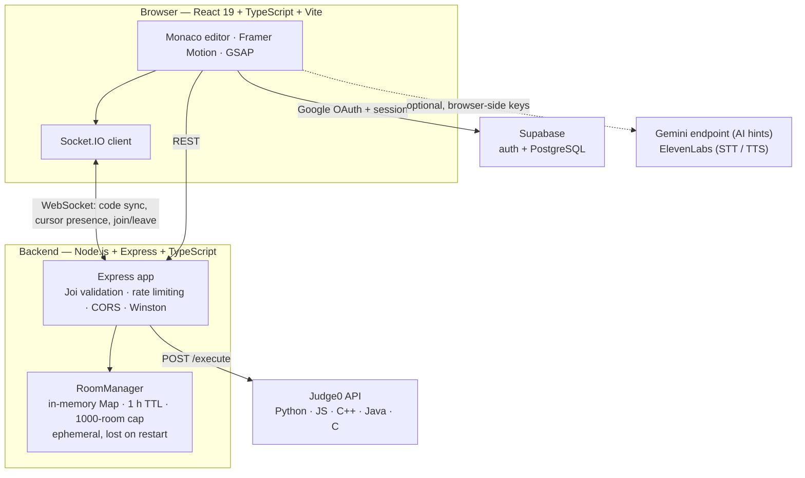

# Code Battlegrounds


**A real-time collaborative code editor with multi-language execution** — several people edit the same Monaco buffer over Socket.IO, run the result on Judge0, and see each other's presence live.

Built at **HackCU12** by **Sneha Nagaraju**, **Meghasrivardhan Pulakhandam**, and **Gunabhiram Aruru**. Team project, hackathon scope.

> **Maturity:** the collaboration and execution core is fully implemented and backed by the Express/Socket.IO server. The classroom, assessment, integrity and analytics surfaces are **UI built against in-file mock data** — see [Implementation status](#-implementation-status) before reading the feature list as a product claim.

[Live demo](https://code-battle-grounds.vercel.app) · [Quick start](#-getting-started) · [Architecture](#-architecture)

---

## 🧩 Implementation status

**Fully implemented — server-backed**

| Feature | How it works |
|---|---|
| Real-time collaborative editing | Monaco editor; code and cursor/presence events synced over Socket.IO |
| Ephemeral rooms | `RoomManager` holds rooms in an in-memory `Map` — 1 h inactivity TTL, 1000-room cap, background cleanup sweep. **Nothing is persisted; a server restart drops every room** |
| One-room-per-user guard | `userEmail → roomId` map rejects joining a second room while connected |
| Multi-language execution | `POST /execute` proxies to Judge0 — Python, JavaScript, C++, Java, C, with custom stdin |
| Auth | Google OAuth via Supabase |
| Hardening | Joi request validation, `rate-limiter-flexible`, CORS allowlist, Winston logging, `/health` and `/metrics` endpoints |

**Optional — requires your own API keys, degrades cleanly without them**

| Feature | How it works |
|---|---|
| AI hints | Tiered hints via a Google Gemini endpoint. The endpoint, key and model are all read from env (`VITE_GEMINI_FETCH_URL`, `VITE_GEMINI_API_KEY`, `VITE_GEMINI_MODEL`) — no model is hardcoded. Unset, the UI reports "AI not configured" instead of failing |
| Voice features | ElevenLabs speech-to-text (`scribe_v1`) and TTS for mock-interview and read-aloud flows, with a browser `SpeechSynthesis` fallback |

**Prototype / mock-backed UI — not wired to a datastore**

| Surface | Status |
|---|---|
| Assessment mode (`/assess`, `/assessment/*`) | Questions, submissions, rubric items and per-student integrity events are **hardcoded arrays** in the page components. The backend has an `assessmentController`, but these views do not read from it |
| Integrity timeline (`/integrity`) | Renders `MOCK_SESSIONS` — a fixed demo dataset, not captured telemetry |
| Class analytics (`/analytics`) | Demo UI only |
| Progress tracking, curated practice sets | DSA problem sets are local data files; progress is not durably tracked server-side |

There is **no proctoring, no durable assessment record, and no analytics pipeline**. Those screens exist to show the intended product shape.

---

## 🧠 Algorithm practice

Curated DSA problem collections (Blind 75, NeetCode 150, topic-based sets) ship as local data, browsable by topic and difficulty and solvable in the same editor.

---

## 📐 Architecture



**Flow:** authenticate with Google via Supabase → pick a role (academic or professional) → create or join a room by code → edits propagate to every connected client over Socket.IO → run the buffer through the backend's Judge0 proxy → optionally request a tiered hint.

**Room state is deliberately ephemeral.** Rooms live in server memory with a one-hour inactivity TTL and a background cleanup sweep. That keeps the hot path free of database round-trips, which is the right trade for a live editing session — and it means sessions do not survive a restart and cannot be replayed later.

## 📊 Routes

Routes as registered in `frontend/src/App.tsx`. "Backing" says where the data actually comes from.

| Page | Route | Backing |
| --- | --- | --- |
| Landing | `/login`, `/landing` | Google OAuth via Supabase |
| Feature selection | `/features`, `/features/academic`, `/features/professional` | Static navigation |
| Classrooms | `/classrooms`, `/create-room` | Socket.IO server, in-memory rooms |
| Code editor | `/editor/:roomId` | Socket.IO sync + Judge0 execution |
| Pair programming | `/pair` | Socket.IO server |
| Algorithm challenges | `/practice`, `/practice/:slug` | Local DSA data files |
| Curated practice sets | `/sets` | Local data (Blind 75, NeetCode 150) |
| Mock interviews | `/interview`, `/interview-dashboard`, `/video-interview` | Optional ElevenLabs / Gemini; no keys → disabled |
| Assessment mode | `/assess`, `/assessment/faculty`, `/assessment/student` | **Mock data in the page components** |
| Integrity timeline | `/integrity` | **`MOCK_SESSIONS` fixture** |
| Class analytics | `/analytics` | **Demo UI** |
| Session replay | `/replay` | **Demo UI** |
| Progress | `/progress` | Client-side |

---

## 🔧 Tech Stack

| Category                 | Technology                                                                 |
| ------------------------ | -------------------------------------------------------------------------- |
| **Frontend**             | React 19, TypeScript, Vite 7, SCSS (BEM)                                   |
| **Editor**               | Monaco Editor (VS Code engine in browser)                                  |
| **Real-time**            | Socket.IO (WebSocket transport)                                            |
| **Animations**           | Framer Motion, GSAP                                                        |
| **Auth**                 | Supabase (Google OAuth)                                                    |
| **Styling**              | SCSS, CSS Variables, Glassmorphism dark theme                              |
| **State**                | React Context + Hooks                                                      |
| **Backend**              | Node.js, Express, TypeScript                                               |
| **Database**             | Supabase (PostgreSQL)                                                      |
| **Code Execution**       | Judge0 API                                                                 |
| **AI Hints**             | Google Gemini — endpoint and model supplied via env, not pinned in source  |
| **Voice**                | ElevenLabs STT (`scribe_v1`) + TTS, with browser SpeechSynthesis fallback  |
| **Validation**           | Joi                                                                        |
| **Rate Limiting**        | rate-limiter-flexible                                                      |
| **Logging**              | Winston                                                                    |
| **Testing**              | Vitest + Testing Library (frontend and backend)                            |
| **Deployment**           | Vercel (frontend), Docker (backend)                                        |

---

## 🚀 Getting Started

### Prerequisites

- **Node.js 18+** and **npm 9+**
- A [Supabase](https://supabase.com) project
- A [Judge0](https://judge0.com) instance (self-hosted or RapidAPI)
- _(Optional)_ A [Gemini API](https://aistudio.google.com) key — only for AI hints
- _(Optional)_ An [ElevenLabs](https://elevenlabs.io) API key — only for voice features

### 1. Clone the repo

```bash
git clone https://github.com/Kanyarasi2026/code-battle-grounds.git
cd code-battle-grounds
```

### 2. Backend setup

```bash
cd backend
npm install
```

Create a `.env` file inside `backend/`:

```env
PORT=3001
CORS_ORIGINS=http://localhost:5173

SUPABASE_URL=your_supabase_project_url
SUPABASE_ANON_KEY=your_supabase_anon_key
SUPABASE_SERVICE_ROLE_KEY=your_supabase_service_role_key

JUDGE0_URL=your_judge0_base_url
```

Start the backend:

```bash
npm run dev
```

### 3. Frontend setup

```bash
cd frontend
npm install
```

Create a `.env` file inside `frontend/`:

```env
VITE_SUPABASE_URL=your_supabase_project_url
VITE_SUPABASE_ANON_KEY=your_supabase_anon_key

VITE_SOCKET_URL=http://localhost:3001

# Optional — omit to run without AI/voice features
VITE_GEMINI_FETCH_URL=your_gemini_endpoint_url
VITE_GEMINI_API_KEY=your_gemini_api_key
VITE_GEMINI_MODEL=your_gemini_model_id
VITE_ELEVENLABS_API_KEY=your_elevenlabs_api_key
```

> **Security note:** anything prefixed `VITE_` is inlined into the client bundle and is readable by anyone who loads the page. The Supabase anon key is designed for that; the Gemini and ElevenLabs keys are **not**. As built, AI and voice calls go directly from the browser to those providers, so use throwaway keys with hard spend limits and never a production key. Routing them through the backend is the fix, and it has not been done.

Start the frontend:

```bash
npm run dev
```

Open [http://localhost:5173](http://localhost:5173) in your browser.

### 4. Supabase setup

In your Supabase project:

1. Enable **Google** as an OAuth provider under **Authentication > Providers**.
2. Add `http://localhost:5173` to your allowed redirect URLs.
3. Run any database migrations found in `backend/migrations/`.

---

## 🧪 Testing

### Frontend tests

```bash
cd frontend
npm test
```

For coverage:

```bash
npm run test:coverage
```

### Backend tests

```bash
cd backend
npm test
```

For coverage:

```bash
npm run test:coverage
```

---

## 📚 Project Structure

```
code-battle-grounds/
├── frontend/                  React + Vite app
│   ├── src/
│   │   ├── components/        Reusable UI (Button, Card, Input, Avatar, etc.)
│   │   │   ├── ai/            AI hint components
│   │   │   ├── editor/        Monaco editor integration
│   │   │   ├── effects/       ParticleField, visual effects
│   │   │   ├── integrity/     Integrity tracking components
│   │   │   ├── layout/        AuthLayout, navigation
│   │   │   ├── output/        Code execution output display
│   │   │   └── ui/            Button, Card, Input, Avatar, Kbd
│   │   ├── context/           AuthContext, RoomContext, NavigationStack
│   │   ├── pages/             Route-level page components
│   │   │   ├── classrooms/    Faculty create / student join classrooms
│   │   │   ├── assessment/    Student & faculty assessment views
│   │   │   ├── challenges/    Algorithm challenge browser & solver
│   │   │   ├── code-editor/   Main collaborative editor page
│   │   │   ├── curated-practice/  Blind 75, NeetCode, practice sets
│   │   │   ├── features/      Mock interview, pair programming, etc.
│   │   │   └── landing/       Landing page with OAuth
│   │   ├── sections/          Hero, Features, CTA sections
│   │   ├── services/          API service layer
│   │   ├── socket/            Socket.IO client + actions
│   │   ├── styles/            Global SCSS variables
│   │   └── types/             TypeScript type definitions
│   └── public/                Static assets
│
├── backend/                   Express + Socket.IO server
│   ├── src/
│   │   ├── controllers/       Route handlers
│   │   ├── middleware/        Auth, validation, rate limiting, error handling
│   │   ├── routes/            REST API routes
│   │   ├── services/          Business logic (profiles, etc.)
│   │   ├── utils/             RoomManager, Logger, RoleManager
│   │   └── types/             TypeScript type definitions
│   └── migrations/            SQL migration files
│
└── README.md
```

---

## 🌐 Deployment

The frontend is deployed on Vercel at [code-battle-grounds.vercel.app](https://code-battle-grounds.vercel.app), auto-deploying from `main`.

The backend ships with a `Dockerfile` and can run anywhere a container can — Railway, Render, Fly.io, or a plain VM. Because room state lives in process memory, the backend does not scale horizontally without sticky sessions or an external state store.

## 🔗 API Integration

The frontend communicates with the backend for:

- **Real-time collaboration** — Socket.IO WebSocket events (code sync, presence)
- **Code execution** — REST endpoint → Judge0 API
- **Room management** — Create/join/validate rooms
- **Authentication** — Supabase OAuth + JWT tokens
- **AI hints** — Gemini API via frontend (with ElevenLabs TTS or browser fallback)
- **Assessments** — CRUD operations for faculty assessment management

---

## ⚠️ Limitations

- **Rooms are ephemeral.** In-memory only, one-hour inactivity TTL, 1000-room cap. A server restart ends every session. There is no persistence, history, or replay of real sessions.
- **Assessment and integrity features are demo UI.** Mock data in the components; no durable assessment records, no submission storage, no proctoring, and no analytics pipeline.
- **AI and voice keys are browser-side.** See the security note above.
- **No horizontal scaling.** Room state in process memory means a second backend instance would not see the first one's rooms.
- **Code execution depends on an external Judge0 instance** you supply; there is no sandbox of our own.
- **Hackathon scope.** Built in a weekend at HackCU12 and not hardened since.

---

## 🤝 Contributing

Contributions are welcome and appreciated! Here's how you can help:

1. **Fork** the repository
2. Create a feature branch (`git checkout -b feature/amazing-feature`)
3. Commit your changes (`git commit -m 'Add amazing feature'`)
4. Push to the branch (`git push origin feature/amazing-feature`)
5. Open a **Pull Request**

---

## 👥 Authors

| Name                            | Links                                                                                                                                                   |
| ------------------------------- | ------------------------------------------------------------------------------------------------------------------------------------------------------- |
| **Sneha Nagaraju**              | [Portfolio](https://www.snehaa.me) · [LinkedIn](https://www.linkedin.com/in/snehan-raju/) · [GitHub](https://github.com/snna2069)                       |
| **Meghasrivardhan Pulakhandam** | [Portfolio](https://www.meghan31.me) · [LinkedIn](https://linkedin.com/in/meghan31) · [GitHub](https://github.com/Meghan31)                             |
| **Gunabhiram Aruru**            | [Portfolio](https://aruru-gunabhiram.netlify.app) · [LinkedIn](https://www.linkedin.com/in/gunabhiram-aruru/) · [GitHub](https://github.com/gunabhiram) |

---

Built at **HackCU12**. Licensed ISC.
